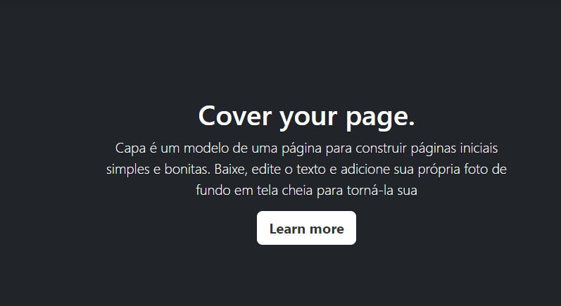

[Projeto - portifolio para escrita do README](#projeto-portifolio-para-escrita-do-readme)   
[Descrição](#descri%C3%A7%C3%A3o)  
[Funcionalidades](#funcionalidade)  
[teclonogias utilizadas](#teclonogias-utilizadas)  
[fontes consultadas](#fontes-consultadas)  
[Autores](#autores)  

# 🚀 projeto portifolio para escrita do README.

## 📌 Descrição
Descrição do projeto portifolio escrita do README,para personalizar a pagina no vs code do jeito que preferir.

## ⚙️ Funcionalidades
A funcionalidade da pagina pode ser personalizada,com fotos,palavras ,cores e tamanhos.

### ❤️ Teclonogias utilizadas
vs code,github,captura de tela,css,README,html,google,pasta,teams

## 📄 Fontes consultadas
https://getbootstrap.com/docs/5.0/getting-started/introduction/

## 🍺 Autores
lara:https://github.com/laraassuncao18/portifolio-pessoal